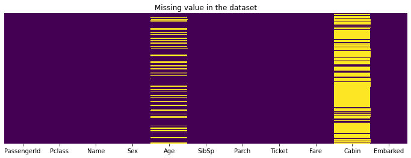

# **Être dans le top 10% d'une compétition Kaggle avec approche simple de Machine Learning** - [voir l'article](https://inside-machinelearning.com/top-10-dune-competition-kaggle-approche-simplee-machine-learning/)

Dans cet article je vous propose une **approche simple et rapide** pour réussir une **compétition Kaggle de Machine Learning !**

Récemment, je me suis mis sur **Kaggle** pour tester mes **skills**.

**Kaggle** est un site qui propose des **compétitions** d'analyse de données et de **Machine Learning**.

Les plus **expérimentés** peuvent y **gagner des prix** allant jusqu'à **100.000$**.. attractif pour des **Data Scientists** comme nous !

Ici je vous propose de voir comment **résoudre** une des **compétitions de base** de Kaggle : [Titanic - Machine Learning from Disaster](https://www.kaggle.com/c/titanic/overview).

Un **cas classique de Machine Learning** où nous devons utiliser **plusieurs types de données** (chiffres et texte) pour faire une **prédiction**.

**Commençons sans plus attendre !** ;)


# **Comprendre les données**

## **Charger les données**

Le but de cette **compétition** est de prédire selon **les caractéristiques d'une personne** (âge, sexe, ...) et **les caractéristiques de son voyage** à bord du Titanic (ticket, port d'embarcation, cabine, ...) si la personne **va survivre**.

Ces **caractéristiques** sont nos données sur lesquels on va **entrainer notre modèle de Machine Learning** pour prédire la **survie des passagers**.

On a accès ici à **deux fichiers** au format CSV:
- train.csv pour **entraîner notre modèle**
- test.csv pour **faire la prédiction**

En fait, vu que c'est une **compétition Kaggle**, les données test ne seront **pas utiliser pour tester le modèle** car il n'y a pas de **données de vérification** (y_test).

On a seulement les **informations**(x_test) **sur les voyageur du Titanic**. Ces données seront utilisés pour faire **une prédiction qu'on soumettra a Kaggle.**

Ensuite cette prédiction sera **automatiquement comparé** par Kaggle avec les **données réelles** (y_test). L'**erreur entre notre prédiction et la réalité** définira notre note et donc **notre place dans la compétition.**

Eh oui ! Si on avait **déjà le résultat** (y_test) on pourrait **facilement tricher.**


Pour commencer, on **charge les données** depuis [Github](https://github.com/tkeldenich/RandomForest_MachineLearning_Categorical_and_Numerical_Data).


```python
!git clone https://github.com/tkeldenich/RandomForest_MachineLearning_Categorical_and_Numerical_Data.git &> /dev/null
```

## **Analyser les données**

On importe les **librairies de base** pour gérer des données :
- *numpy*
- *pandas*


```python
import numpy as np
import pandas as pd
```

Dans un premier temps, on regarde **la structure de nos donnée**s :
- **PassengerId**, le numéro du passager
- **Survived**, si 1 le passager a survécu, 0 sinon (ce sont les données que nous devons prédire)
- **Pclass**, la classe du passager 1 étant la meilleur, 3 la moins bonne
- **Name**, le nom du passager
- **Sex**, le sexe de l'individu
- **Age**, l'âge du passager
- **SibSp**, nombre de frère et sœur du passager à bord du Titanic
- **Parch**, nombre de parents du passager à bord du Titanic
- **Ticket**, le numéro du Ticket
- **Fare**, prix du Ticket
- **Cabin**, le numéro de cabine
- **Embarked**, port d'embarcation C pour Cherbourg, Q pour Queenstown, S pour Southampton

On **charge donc les données** et on les **affiche :**


```python
train_data = pd.read_csv("/content/RandomForest_MachineLearning_Categorical_and_Numerical_Data/train.csv")

train_data.head(2)
```


<div>
<style scoped>
    .dataframe tbody tr th:only-of-type {
        vertical-align: middle;
    }

    .dataframe tbody tr th {
        vertical-align: top;
    }

    .dataframe thead th {
        text-align: right;
    }
</style>
<table border="1" class="dataframe">
  <thead>
    <tr style="text-align: right;">
      <th></th>
      <th>PassengerId</th>
      <th>Survived</th>
      <th>Pclass</th>
      <th>Name</th>
      <th>Sex</th>
      <th>Age</th>
      <th>SibSp</th>
      <th>Parch</th>
      <th>Ticket</th>
      <th>Fare</th>
      <th>Cabin</th>
      <th>Embarked</th>
    </tr>
  </thead>
  <tbody>
    <tr>
      <th>0</th>
      <td>1</td>
      <td>0</td>
      <td>3</td>
      <td>Braund, Mr. Owen Harris</td>
      <td>male</td>
      <td>22.0</td>
      <td>1</td>
      <td>0</td>
      <td>A/5 21171</td>
      <td>7.2500</td>
      <td>NaN</td>
      <td>S</td>
    </tr>
    <tr>
      <th>1</th>
      <td>2</td>
      <td>1</td>
      <td>1</td>
      <td>Cumings, Mrs. John Bradley (Florence Briggs Th...</td>
      <td>female</td>
      <td>38.0</td>
      <td>1</td>
      <td>0</td>
      <td>PC 17599</td>
      <td>71.2833</td>
      <td>C85</td>
      <td>C</td>
    </tr>
  </tbody>
</table>
</div>


On peut aussi regarder les **données de test** et on voit que la colonne **Survived** n'est effectivement **pas présente** comme expliqué précédemment.


```python
test_data = pd.read_csv("/content/RandomForest_MachineLearning_Categorical_and_Numerical_Data/test.csv")

test_data.head(2)
```


<div>
<style scoped>
    .dataframe tbody tr th:only-of-type {
        vertical-align: middle;
    }

    .dataframe tbody tr th {
        vertical-align: top;
    }

    .dataframe thead th {
        text-align: right;
    }
</style>
<table border="1" class="dataframe">
  <thead>
    <tr style="text-align: right;">
      <th></th>
      <th>PassengerId</th>
      <th>Pclass</th>
      <th>Name</th>
      <th>Sex</th>
      <th>Age</th>
      <th>SibSp</th>
      <th>Parch</th>
      <th>Ticket</th>
      <th>Fare</th>
      <th>Cabin</th>
      <th>Embarked</th>
    </tr>
  </thead>
  <tbody>
    <tr>
      <th>0</th>
      <td>892</td>
      <td>3</td>
      <td>Kelly, Mr. James</td>
      <td>male</td>
      <td>34.5</td>
      <td>0</td>
      <td>0</td>
      <td>330911</td>
      <td>7.8292</td>
      <td>NaN</td>
      <td>Q</td>
    </tr>
    <tr>
      <th>1</th>
      <td>893</td>
      <td>3</td>
      <td>Wilkes, Mrs. James (Ellen Needs)</td>
      <td>female</td>
      <td>47.0</td>
      <td>1</td>
      <td>0</td>
      <td>363272</td>
      <td>7.0000</td>
      <td>NaN</td>
      <td>S</td>
    </tr>
  </tbody>
</table>
</div>


Ensuite, **pour plus de commodités**, on sépare la **colonne à prédire Survived** des autres colonnes de note dataset.


```python
train_targets = train_data[['Survived']]
train_data = train_data.drop('Survived', axis = 1)
```

Avant d'effectuer le preprocessing **on rassemble les données d'entraînement et de test** dans un même dataset pour que la **transformation** s'applique sur toute nos données.


```python
data = pd.concat([train_data, test_data])
```

## **Processing des données**

### **Transformation**

Vient l'étape **la plus importante** du Machine Learning : **le preprocessing.**

Le **preprocessing** consiste à **transformer les données** pour que **le modèle de Machine Learning** puisse les ingurgiter, les **comprendre.**

Ici quelques données nous **posent problèmes**, ce sont **les données catégorielles** (par opposition aux données numériques).

Par exemple la colonne **Embarked**. Elle n'a pas de données chiffrées. Au contraire, elle possède **des catégories** :
- Cherbourg
- Queenstown
- Southampton

Il faut  **transformer ces données en chiffres** pour que le modèle de Machine Learning puissent les comprendre, **les interpréter.**

Pour cela on utilise le **One-Hot Encoding** dont on a déjà parlé dans [cet article](https://inside-machinelearning.com/preprocessing-nlp-tutoriel-pour-nettoyer-rapidement-un-texte/).

La **librairie** *pandas* nous offre une manière simple et rapide d'effectuer le **One-Hot Encoding** : la fonction *get_dummies()*.

Elle **transforme une colonne** d'un dataframe **en plusieurs colonnes One-Hot encoded.**

Par exemple, avec la colonne **Embarked**, on a **trois catégories.** Eh bien *get_dummies()* va créer **trois colonnes** qui représenteront chacune **une catégorie**.

On aura donc une colonne pour **Cherbourg**, une pour **Queenstown** et une autre pour **Southampton.**

Si un **passager** a embarqué à **Cherbourg** un **1** sera inscrit **dans cette colonne** et un **0 dans les autres.** Cela pour chaque passager **selon le port embarqué.**

**Concrétement**, voilà ce que ça donne :


```python
pd.get_dummies(data["Embarked"]).head()
```


<div>
<style scoped>
    .dataframe tbody tr th:only-of-type {
        vertical-align: middle;
    }

    .dataframe tbody tr th {
        vertical-align: top;
    }

    .dataframe thead th {
        text-align: right;
    }
</style>
<table border="1" class="dataframe">
  <thead>
    <tr style="text-align: right;">
      <th></th>
      <th>C</th>
      <th>Q</th>
      <th>S</th>
    </tr>
  </thead>
  <tbody>
    <tr>
      <th>0</th>
      <td>0</td>
      <td>0</td>
      <td>1</td>
    </tr>
    <tr>
      <th>1</th>
      <td>1</td>
      <td>0</td>
      <td>0</td>
    </tr>
    <tr>
      <th>2</th>
      <td>0</td>
      <td>0</td>
      <td>1</td>
    </tr>
    <tr>
      <th>3</th>
      <td>0</td>
      <td>0</td>
      <td>1</td>
    </tr>
    <tr>
      <th>4</th>
      <td>0</td>
      <td>0</td>
      <td>1</td>
    </tr>
  </tbody>
</table>
</div>


Cela veut dire que **le passager numéro 0** à embarquer à **Southampton**, le **numéro 1** à **Cherbourg** le **numéro 2** à **Southampton** etc.

On va appliquer ce **One-Hot Encoding** sur **les colonnes que l'on estime importante** pour déterminer si une personne à **survécu ou non.**

On choisit ici :
- **Embarked**
- **Sex**
- **Cabin**


```python
features = ["Embarked", "Sex", "Cabin"]
new_data = pd.get_dummies(data[features])
```

En plus de **ces données catégorielles** processées, on ajoute **les données chiffrées** importantes.

### **Vérification**

Avec cela on devrait avoir un **bon dataset** pour faire notre **prédiction** !


```python
new_data = pd.concat([new_data,data[['Pclass', 'Age', 'SibSp', 'Parch']]], axis = 1)
```

Puis, on peut **afficher notre dataset :**


```python
new_data.head(2)
```


<div>
<style scoped>
    .dataframe tbody tr th:only-of-type {
        vertical-align: middle;
    }

    .dataframe tbody tr th {
        vertical-align: top;
    }

    .dataframe thead th {
        text-align: right;
    }
</style>
<table border="1" class="dataframe">
  <thead>
    <tr style="text-align: right;">
      <th></th>
      <th>Embarked_C</th>
      <th>Embarked_Q</th>
      <th>Embarked_S</th>
      <th>Sex_female</th>
      <th>Sex_male</th>
      <th>Cabin_A10</th>
      <th>Cabin_A11</th>
      <th>Cabin_A14</th>
      <th>Cabin_A16</th>
      <th>Cabin_A18</th>
      <th>Cabin_A19</th>
      <th>Cabin_A20</th>
      <th>Cabin_A21</th>
      <th>Cabin_A23</th>
      <th>Cabin_A24</th>
      <th>Cabin_A26</th>
      <th>Cabin_A29</th>
      <th>Cabin_A31</th>
      <th>Cabin_A32</th>
      <th>Cabin_A34</th>
      <th>Cabin_A36</th>
      <th>Cabin_A5</th>
      <th>Cabin_A6</th>
      <th>Cabin_A7</th>
      <th>Cabin_A9</th>
      <th>Cabin_B10</th>
      <th>Cabin_B101</th>
      <th>Cabin_B102</th>
      <th>Cabin_B11</th>
      <th>Cabin_B18</th>
      <th>Cabin_B19</th>
      <th>Cabin_B20</th>
      <th>Cabin_B22</th>
      <th>Cabin_B24</th>
      <th>Cabin_B26</th>
      <th>Cabin_B28</th>
      <th>Cabin_B3</th>
      <th>Cabin_B30</th>
      <th>Cabin_B35</th>
      <th>Cabin_B36</th>
      <th>...</th>
      <th>Cabin_E121</th>
      <th>Cabin_E17</th>
      <th>Cabin_E24</th>
      <th>Cabin_E25</th>
      <th>Cabin_E31</th>
      <th>Cabin_E33</th>
      <th>Cabin_E34</th>
      <th>Cabin_E36</th>
      <th>Cabin_E38</th>
      <th>Cabin_E39 E41</th>
      <th>Cabin_E40</th>
      <th>Cabin_E44</th>
      <th>Cabin_E45</th>
      <th>Cabin_E46</th>
      <th>Cabin_E49</th>
      <th>Cabin_E50</th>
      <th>Cabin_E52</th>
      <th>Cabin_E58</th>
      <th>Cabin_E60</th>
      <th>Cabin_E63</th>
      <th>Cabin_E67</th>
      <th>Cabin_E68</th>
      <th>Cabin_E77</th>
      <th>Cabin_E8</th>
      <th>Cabin_F</th>
      <th>Cabin_F E46</th>
      <th>Cabin_F E57</th>
      <th>Cabin_F E69</th>
      <th>Cabin_F G63</th>
      <th>Cabin_F G73</th>
      <th>Cabin_F2</th>
      <th>Cabin_F33</th>
      <th>Cabin_F38</th>
      <th>Cabin_F4</th>
      <th>Cabin_G6</th>
      <th>Cabin_T</th>
      <th>Pclass</th>
      <th>Age</th>
      <th>SibSp</th>
      <th>Parch</th>
    </tr>
  </thead>
  <tbody>
    <tr>
      <th>0</th>
      <td>0</td>
      <td>0</td>
      <td>1</td>
      <td>0</td>
      <td>1</td>
      <td>0</td>
      <td>0</td>
      <td>0</td>
      <td>0</td>
      <td>0</td>
      <td>0</td>
      <td>0</td>
      <td>0</td>
      <td>0</td>
      <td>0</td>
      <td>0</td>
      <td>0</td>
      <td>0</td>
      <td>0</td>
      <td>0</td>
      <td>0</td>
      <td>0</td>
      <td>0</td>
      <td>0</td>
      <td>0</td>
      <td>0</td>
      <td>0</td>
      <td>0</td>
      <td>0</td>
      <td>0</td>
      <td>0</td>
      <td>0</td>
      <td>0</td>
      <td>0</td>
      <td>0</td>
      <td>0</td>
      <td>0</td>
      <td>0</td>
      <td>0</td>
      <td>0</td>
      <td>...</td>
      <td>0</td>
      <td>0</td>
      <td>0</td>
      <td>0</td>
      <td>0</td>
      <td>0</td>
      <td>0</td>
      <td>0</td>
      <td>0</td>
      <td>0</td>
      <td>0</td>
      <td>0</td>
      <td>0</td>
      <td>0</td>
      <td>0</td>
      <td>0</td>
      <td>0</td>
      <td>0</td>
      <td>0</td>
      <td>0</td>
      <td>0</td>
      <td>0</td>
      <td>0</td>
      <td>0</td>
      <td>0</td>
      <td>0</td>
      <td>0</td>
      <td>0</td>
      <td>0</td>
      <td>0</td>
      <td>0</td>
      <td>0</td>
      <td>0</td>
      <td>0</td>
      <td>0</td>
      <td>0</td>
      <td>3</td>
      <td>22.0</td>
      <td>1</td>
      <td>0</td>
    </tr>
    <tr>
      <th>1</th>
      <td>1</td>
      <td>0</td>
      <td>0</td>
      <td>1</td>
      <td>0</td>
      <td>0</td>
      <td>0</td>
      <td>0</td>
      <td>0</td>
      <td>0</td>
      <td>0</td>
      <td>0</td>
      <td>0</td>
      <td>0</td>
      <td>0</td>
      <td>0</td>
      <td>0</td>
      <td>0</td>
      <td>0</td>
      <td>0</td>
      <td>0</td>
      <td>0</td>
      <td>0</td>
      <td>0</td>
      <td>0</td>
      <td>0</td>
      <td>0</td>
      <td>0</td>
      <td>0</td>
      <td>0</td>
      <td>0</td>
      <td>0</td>
      <td>0</td>
      <td>0</td>
      <td>0</td>
      <td>0</td>
      <td>0</td>
      <td>0</td>
      <td>0</td>
      <td>0</td>
      <td>...</td>
      <td>0</td>
      <td>0</td>
      <td>0</td>
      <td>0</td>
      <td>0</td>
      <td>0</td>
      <td>0</td>
      <td>0</td>
      <td>0</td>
      <td>0</td>
      <td>0</td>
      <td>0</td>
      <td>0</td>
      <td>0</td>
      <td>0</td>
      <td>0</td>
      <td>0</td>
      <td>0</td>
      <td>0</td>
      <td>0</td>
      <td>0</td>
      <td>0</td>
      <td>0</td>
      <td>0</td>
      <td>0</td>
      <td>0</td>
      <td>0</td>
      <td>0</td>
      <td>0</td>
      <td>0</td>
      <td>0</td>
      <td>0</td>
      <td>0</td>
      <td>0</td>
      <td>0</td>
      <td>0</td>
      <td>1</td>
      <td>38.0</td>
      <td>1</td>
      <td>0</td>
    </tr>
  </tbody>
</table>
<p>2 rows × 195 columns</p>
</div>


Il y a aussi d'autres types de donnés qui sont **ni chiffrées, ni catégoriques.** Par exemple la colonne **Ticket** est une chaîne de caractère indiquant **le numéro de ticket** du passager.

Pour le coup, c'est **typiquement** une donnée qui ne nous indiquera pas si le passager survivra ou non. Au contraire, le numéro de ticket agit plutôt **comme PassengerId**, un numéro qui permet de **différencier un passager d'un autre.**

Pas besoin dans ce cas de **le prendre en compte.**

Une **vérification intéressante** néanmoins est de voir si notre dataset est **totalement rempli**, s'il n'y a **pas de valeur manquante.**

On peut utiliser les **librairies** *matplotlib* et *seaborn* pour cela.

Elles permettent de nous **afficher** joliement où se trouvent nos **données manquantes** (les lignes jaunes).

**Dans notre cas**, elles sont au niveau de la colonne **Age** et **Cabin**. Par ailleurs, il y a **beaucoup de données manquantes** dans cette dernière.


```python
from matplotlib import pyplot as plt
import seaborn as sns

plt.figure(figsize=(12,4))
sns.heatmap(data.isnull(),cbar=False,cmap='viridis',yticklabels=False)
plt.title('Missing value in the dataset');
```


    

    


Le **modèle n'acceptera pas** ces données manquantes écrites **NaN**.

On utilise alors la fonction *fillna(0)* qui **remplace** tous les **NaN par 0.** Cela permettra à notre modèle de Machine Learning de **comprendre que ces valeurs sont nulles.**


```python
new_data = new_data.fillna(0)
new_data.head(3)
```


<div>
<style scoped>
    .dataframe tbody tr th:only-of-type {
        vertical-align: middle;
    }

    .dataframe tbody tr th {
        vertical-align: top;
    }

    .dataframe thead th {
        text-align: right;
    }
</style>
<table border="1" class="dataframe">
  <thead>
    <tr style="text-align: right;">
      <th></th>
      <th>Embarked_C</th>
      <th>Embarked_Q</th>
      <th>Embarked_S</th>
      <th>Sex_female</th>
      <th>Sex_male</th>
      <th>Cabin_A10</th>
      <th>Cabin_A11</th>
      <th>Cabin_A14</th>
      <th>Cabin_A16</th>
      <th>Cabin_A18</th>
      <th>Cabin_A19</th>
      <th>Cabin_A20</th>
      <th>Cabin_A21</th>
      <th>Cabin_A23</th>
      <th>Cabin_A24</th>
      <th>Cabin_A26</th>
      <th>Cabin_A29</th>
      <th>Cabin_A31</th>
      <th>Cabin_A32</th>
      <th>Cabin_A34</th>
      <th>Cabin_A36</th>
      <th>Cabin_A5</th>
      <th>Cabin_A6</th>
      <th>Cabin_A7</th>
      <th>Cabin_A9</th>
      <th>Cabin_B10</th>
      <th>Cabin_B101</th>
      <th>Cabin_B102</th>
      <th>Cabin_B11</th>
      <th>Cabin_B18</th>
      <th>Cabin_B19</th>
      <th>Cabin_B20</th>
      <th>Cabin_B22</th>
      <th>Cabin_B24</th>
      <th>Cabin_B26</th>
      <th>Cabin_B28</th>
      <th>Cabin_B3</th>
      <th>Cabin_B30</th>
      <th>Cabin_B35</th>
      <th>Cabin_B36</th>
      <th>...</th>
      <th>Cabin_E121</th>
      <th>Cabin_E17</th>
      <th>Cabin_E24</th>
      <th>Cabin_E25</th>
      <th>Cabin_E31</th>
      <th>Cabin_E33</th>
      <th>Cabin_E34</th>
      <th>Cabin_E36</th>
      <th>Cabin_E38</th>
      <th>Cabin_E39 E41</th>
      <th>Cabin_E40</th>
      <th>Cabin_E44</th>
      <th>Cabin_E45</th>
      <th>Cabin_E46</th>
      <th>Cabin_E49</th>
      <th>Cabin_E50</th>
      <th>Cabin_E52</th>
      <th>Cabin_E58</th>
      <th>Cabin_E60</th>
      <th>Cabin_E63</th>
      <th>Cabin_E67</th>
      <th>Cabin_E68</th>
      <th>Cabin_E77</th>
      <th>Cabin_E8</th>
      <th>Cabin_F</th>
      <th>Cabin_F E46</th>
      <th>Cabin_F E57</th>
      <th>Cabin_F E69</th>
      <th>Cabin_F G63</th>
      <th>Cabin_F G73</th>
      <th>Cabin_F2</th>
      <th>Cabin_F33</th>
      <th>Cabin_F38</th>
      <th>Cabin_F4</th>
      <th>Cabin_G6</th>
      <th>Cabin_T</th>
      <th>Pclass</th>
      <th>Age</th>
      <th>SibSp</th>
      <th>Parch</th>
    </tr>
  </thead>
  <tbody>
    <tr>
      <th>0</th>
      <td>0</td>
      <td>0</td>
      <td>1</td>
      <td>0</td>
      <td>1</td>
      <td>0</td>
      <td>0</td>
      <td>0</td>
      <td>0</td>
      <td>0</td>
      <td>0</td>
      <td>0</td>
      <td>0</td>
      <td>0</td>
      <td>0</td>
      <td>0</td>
      <td>0</td>
      <td>0</td>
      <td>0</td>
      <td>0</td>
      <td>0</td>
      <td>0</td>
      <td>0</td>
      <td>0</td>
      <td>0</td>
      <td>0</td>
      <td>0</td>
      <td>0</td>
      <td>0</td>
      <td>0</td>
      <td>0</td>
      <td>0</td>
      <td>0</td>
      <td>0</td>
      <td>0</td>
      <td>0</td>
      <td>0</td>
      <td>0</td>
      <td>0</td>
      <td>0</td>
      <td>...</td>
      <td>0</td>
      <td>0</td>
      <td>0</td>
      <td>0</td>
      <td>0</td>
      <td>0</td>
      <td>0</td>
      <td>0</td>
      <td>0</td>
      <td>0</td>
      <td>0</td>
      <td>0</td>
      <td>0</td>
      <td>0</td>
      <td>0</td>
      <td>0</td>
      <td>0</td>
      <td>0</td>
      <td>0</td>
      <td>0</td>
      <td>0</td>
      <td>0</td>
      <td>0</td>
      <td>0</td>
      <td>0</td>
      <td>0</td>
      <td>0</td>
      <td>0</td>
      <td>0</td>
      <td>0</td>
      <td>0</td>
      <td>0</td>
      <td>0</td>
      <td>0</td>
      <td>0</td>
      <td>0</td>
      <td>3</td>
      <td>22.0</td>
      <td>1</td>
      <td>0</td>
    </tr>
    <tr>
      <th>1</th>
      <td>1</td>
      <td>0</td>
      <td>0</td>
      <td>1</td>
      <td>0</td>
      <td>0</td>
      <td>0</td>
      <td>0</td>
      <td>0</td>
      <td>0</td>
      <td>0</td>
      <td>0</td>
      <td>0</td>
      <td>0</td>
      <td>0</td>
      <td>0</td>
      <td>0</td>
      <td>0</td>
      <td>0</td>
      <td>0</td>
      <td>0</td>
      <td>0</td>
      <td>0</td>
      <td>0</td>
      <td>0</td>
      <td>0</td>
      <td>0</td>
      <td>0</td>
      <td>0</td>
      <td>0</td>
      <td>0</td>
      <td>0</td>
      <td>0</td>
      <td>0</td>
      <td>0</td>
      <td>0</td>
      <td>0</td>
      <td>0</td>
      <td>0</td>
      <td>0</td>
      <td>...</td>
      <td>0</td>
      <td>0</td>
      <td>0</td>
      <td>0</td>
      <td>0</td>
      <td>0</td>
      <td>0</td>
      <td>0</td>
      <td>0</td>
      <td>0</td>
      <td>0</td>
      <td>0</td>
      <td>0</td>
      <td>0</td>
      <td>0</td>
      <td>0</td>
      <td>0</td>
      <td>0</td>
      <td>0</td>
      <td>0</td>
      <td>0</td>
      <td>0</td>
      <td>0</td>
      <td>0</td>
      <td>0</td>
      <td>0</td>
      <td>0</td>
      <td>0</td>
      <td>0</td>
      <td>0</td>
      <td>0</td>
      <td>0</td>
      <td>0</td>
      <td>0</td>
      <td>0</td>
      <td>0</td>
      <td>1</td>
      <td>38.0</td>
      <td>1</td>
      <td>0</td>
    </tr>
    <tr>
      <th>2</th>
      <td>0</td>
      <td>0</td>
      <td>1</td>
      <td>1</td>
      <td>0</td>
      <td>0</td>
      <td>0</td>
      <td>0</td>
      <td>0</td>
      <td>0</td>
      <td>0</td>
      <td>0</td>
      <td>0</td>
      <td>0</td>
      <td>0</td>
      <td>0</td>
      <td>0</td>
      <td>0</td>
      <td>0</td>
      <td>0</td>
      <td>0</td>
      <td>0</td>
      <td>0</td>
      <td>0</td>
      <td>0</td>
      <td>0</td>
      <td>0</td>
      <td>0</td>
      <td>0</td>
      <td>0</td>
      <td>0</td>
      <td>0</td>
      <td>0</td>
      <td>0</td>
      <td>0</td>
      <td>0</td>
      <td>0</td>
      <td>0</td>
      <td>0</td>
      <td>0</td>
      <td>...</td>
      <td>0</td>
      <td>0</td>
      <td>0</td>
      <td>0</td>
      <td>0</td>
      <td>0</td>
      <td>0</td>
      <td>0</td>
      <td>0</td>
      <td>0</td>
      <td>0</td>
      <td>0</td>
      <td>0</td>
      <td>0</td>
      <td>0</td>
      <td>0</td>
      <td>0</td>
      <td>0</td>
      <td>0</td>
      <td>0</td>
      <td>0</td>
      <td>0</td>
      <td>0</td>
      <td>0</td>
      <td>0</td>
      <td>0</td>
      <td>0</td>
      <td>0</td>
      <td>0</td>
      <td>0</td>
      <td>0</td>
      <td>0</td>
      <td>0</td>
      <td>0</td>
      <td>0</td>
      <td>0</td>
      <td>3</td>
      <td>26.0</td>
      <td>0</td>
      <td>0</td>
    </tr>
  </tbody>
</table>
<p>3 rows × 195 columns</p>
</div>


Vous vous souvenez.. **tout à l'heure** on a créer un seul dataset avec **les données train et test.** Il est temps de **séparer à nouveau** ces datasets pour utiliser **le premier pour l'entraînement** du modèle et **le deuxième pour la prédiction.**


```python
X_train = new_data[:len(train_data)]
X_test = new_data[len(train_data):]
```

On créer aussi une variable **y_train** contenant **la colonne a prédire**, Survived, **sous forme d'array** et non de Dataframe. **y_train** doit être sous cette forme pour **effectuer du Machine Learning.**


```python
y_train = train_targets.values.ravel()
```

# **Prédire avec le Machine Learning**

## **Créer un modèle**

Pour ce **jeux de données** nous allons utilisé une **Forêt d'Arbres de Décision** aussi appelé *Random Forest*.

Ce modèle de Machine Learning applique **plusieurs Arbres de Décision** sur des parties différentes de notre **jeu de données**. De tel sorte, l'ensemble de ces Arbres de Décision nous donne une **vue d'ensemble** assez **exact sur nos données** et permet ainsi d'effectuer **une bonne prédiction**.

En fait, l'Arbre de Décision de base est un **classificateur**. C'est à dire que si on lui donne **les caractéristiques d'un passager** il le classifiera **soit en tant que survivant** soit en tant que non survivant, **idéal pour notre compétition !**

L'idée d'un **Random Forest** est de prendre la **prédiction majoritaire** de tous ses Arbres de Décision.

Par exemple, on fait **une prédiction sur un passager**. Trois Arbres de Décision classent ce passager **comme survivant** et deux autres font l'inverse. Eh bien le **Random Forest** prend la prédiction majoritaire : **survivant.**

On utilise ici la **librairie** *sklearn* pour initialiser un **Random Forest.**

La fonction *RandomForestClassifier()* a **trois paramètres principaux** :
- **n_estimators**, le nombre d'Arbres de Décision
- **max_depth**, la profondeur maximale d'un arbre (None si on ne veut pas de limite prédéfinie)
- **random_state**, permet de contrôler l'aspect aléatoire du Random Forest (la séparation du jeu de données pour l'entraînement des Arbres de Décision)


```python
from sklearn.ensemble import RandomForestClassifier

model = RandomForestClassifier(n_estimators=100, max_depth=3, random_state=3)
```

On peut ensuite construire **une forêt d'arbres** à partir de **l'ensemble d'apprentissage** (X_train, y_train).

En fait, on **entraîne notre modèle** de Random Forest à **prédire les données y_train** en fonction des données x_train.


```python
model.fit(X_train, y_train)
```


    RandomForestClassifier(bootstrap=True, ccp_alpha=0.0, class_weight=None,
                           criterion='gini', max_depth=3, max_features='auto',
                           max_leaf_nodes=None, max_samples=None,
                           min_impurity_decrease=0.0, min_impurity_split=None,
                           min_samples_leaf=1, min_samples_split=2,
                           min_weight_fraction_leaf=0.0, n_estimators=100,
                           n_jobs=None, oob_score=False, random_state=3, verbose=0,
                           warm_start=False)


On **évalue la précision** de notre modèle avec la **validation croisée** qui sépare notre jeu de données en **K sous-ensemble**, K sous-groupe. Le modèle s'entraîne sur K-1 sous-ensemble et **évalue sa précision** sur le Kème.

Pour cela, on utilise la **fonction** *cross_val_score()* de *sklearn* où il faut indiquer **le modèle à évaluer**, les données et **cv** le nombre de **sous-ensemble.**


```python
from sklearn.model_selection import cross_val_score
from statistics import mean

scores = cross_val_score(model, X_train, y_train, cv=5)
print(mean(scores))
```

    0.7902014939426276


## **Améliorer le modèle**

La deuxième **étape la plus importante** du Machine Learning est l'**amélioration du modèle.**

Une fois qu'on a **réussi** à faire une prédiction, à trouver un **modèle statistique** pour interpréter nos données, **on doit l'optimiser.**

Pour cela, il n'y a qu'**une seule méthode :** la pratique. **On ne l'entendra jamais assez** mais le Machine Learning c'est **avant tout de la pratique.**

Tester **différentes approches**, retirer certaines données, en ajouter d'autres, **expérimenter différentes combinaisons**, changer **les paramètres du modèle** de Machine Learning, voir même changer de **modèle de Machine Learning.**

Bref ! **On l'aura compris..** il faut **explorer** par nous même tous ces **facteurs** pour trouver la **configuration qui convient le mieux** à nos données.

Je vous ai présenté précédemment **la meilleure configuration** que j'ai trouvé.

Au début, j'ai commencé avec **200 Arbres de décisions** que j'ai réduit ensuite à **100.** J'ai aussi considéré les **numéros de Tickets** dans ma prédiction.. parce que.. eh bien **pourquoi pas ?** Il s'avérait qu'ils faisaient baisser la précision du modèle.. Je les ai donc **mis de côté.**

La **configuration actuelle** m'a permis d'avoir une précision de **0.79186** et d'être dans le **top 9% !**

On peut encore **faire mieux !** Explorez, expérimentez et testez par vous-même pour **trouver la meilleure solution !**

Une fois qu'on a testé **plusieurs approches** et que **le modèle nous satisfait** on peut l'utiliser sur les données à **prédire X_test.**


```python
predictions = model.predict(X_test)
```

On transforme cette prédiction en **DataFrame** :


```python
output = pd.DataFrame({'PassengerId': test_data.PassengerId, 'Survived': predictions})
```

Pour ensuite que nos prédiction soit facilement **soumissibles a Kaggle en format CSV.**


```python
output.to_csv('my_submission.csv', index=False)
```

Et voilà, c'est ainsi qu'on peut **utiliser un modèle simple de Machine Learning** pour faire **mieux que la plupart des participants** à cette compétition ! :)
